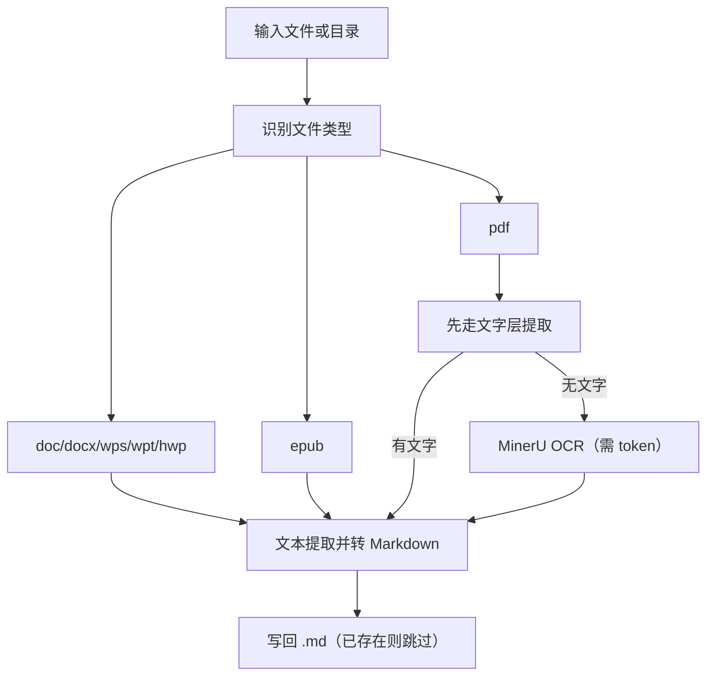

# convert_mixed_to_md

[](https://www.python.org/)
[](#)
[](#支持格式)
[](#使用方式)

批量把 `.doc`、`.docx`、`.epub`、`.pdf`、`.wps`、`.wpt`、`.hwp` 转成 Markdown，默认自动跳过已转换文件，适合持续整理资料库。

> **必看：扫描版 PDF 需要 `MINERU_TOKEN`**
>
> - 普通 PDF（有文字层）通常不需要 token。  
> - 扫描版 / 纯图片 PDF 没有 `MINERU_TOKEN` 时，转换很可能失败。  
> - 这不是脚本 bug，而是 OCR 服务鉴权要求。

## 快速开始

1. 安装 Python 3.9+。  
2. 安装系统命令：`pandoc` + `pdftotext`。  
3. 直接运行一键脚本。

| 场景 | 启动方式 |
|---|---|
| macOS | 双击 `run.command` 或拖文件/目录到 `run.command` |
| Windows | 双击 `run_windows.bat` 或拖文件/目录到 `run_windows.bat` |

你也可以用短名入口：

- `mix2md.command`（macOS）
- `mix2md.bat`（Windows）
- `mix2md.py`（命令行）

## 工作流



## 支持格式

| 格式 | 处理方式 | 备注 |
|---|---|---|
| `.doc` | 旧版解析 + 兜底提取 | 建议尽量转 `.docx` 更稳 |
| `.docx` | `pandoc` | 稳定 |
| `.epub` | `pandoc` | 可能生成 `_assets` 资源目录 |
| `.pdf` | 文字层提取 + OCR 兜底 | 扫描版建议配置 `MINERU_TOKEN` |
| `.wps/.wpt` | 旧版文档解析 | 成功率受原始文件影响 |
| `.hwp` | `hwp5txt`（自动安装 `pyhwp`） | 首次可能稍慢 |

## 安装

### 1. Python

需要 Python 3.9+。

### 2. 系统命令

macOS:

```bash
brew install pandoc poppler
```

Windows（任选一种）:

PowerShell + winget:

```powershell
winget install --id JohnMacFarlane.Pandoc -e
winget install --id oschwartz10612.Poppler -e
```

Chocolatey:

```powershell
choco install pandoc poppler -y
```

安装后请确认：

- `pandoc`
- `pdftotext`

说明：`pandoc` 和 `pdftotext` 是第三方工具官方命令名，不能改名。  
我们已在项目内提供了可自定义短名入口 `mix2md`（见上）。

### 3. Python 依赖（自动）

脚本首次运行会自动创建本地 `.venv` 并安装 `requirements.txt`。  
通常不需要手动 `pip install`。

## 使用方式

### 一键方式（推荐）

- macOS：`run.command`
- Windows：`run_windows.bat`

Windows 版支持：

- 双击运行
- 拖拽文件/目录
- 连续输入多路径
- 粘贴多路径（如 `"C:\a.docx" "D:\b.pdf"` 或 `C:\a.docxC:\b.pdf`）

### 命令行方式

macOS / Linux:

```bash
python3 mix2md.py '/path/to/folder'
python3 convert_mixed_to_md.py '/path/to/folder'
python3 convert_mixed_to_md.py '/path/to/file.epub'
python3 convert_mixed_to_md.py '/path/to/folder' -o '/path/to/output'
```

Windows:

```powershell
python .\mix2md.py "C:\path\to\folder"
python .\convert_mixed_to_md.py "C:\path\to\folder"
python .\convert_mixed_to_md.py "C:\path\to\file.epub"
python .\convert_mixed_to_md.py "C:\path\to\folder" -o "C:\path\to\output"
```

## 扫描版 PDF 与 MinerU

配置 `MINERU_TOKEN` 后，扫描版 PDF 可以自动走 OCR。

macOS / Linux:

```bash
export MINERU_TOKEN='your_token'
python3 convert_mixed_to_md.py '/path/to/folder'
```

Windows PowerShell:

```powershell
$env:MINERU_TOKEN='your_token'
python .\convert_mixed_to_md.py "C:\path\to\folder"
```

Windows CMD:

```bat
set MINERU_TOKEN=your_token
python .\convert_mixed_to_md.py "C:\path\to\folder"
```

## 常见问题

**Q1: 为什么有些 PDF 转换失败？**  
大概率是扫描版且未配置 `MINERU_TOKEN`，或 OCR 服务暂时不可用。

**Q2: 为什么 Windows 下旧 `.doc/.wps/.wpt` 成功率不稳定？**  
这类旧格式本身结构复杂，建议优先转 `.docx` 后再转 Markdown。

**Q3: 为什么有的文件被 `[SKIP]`？**  
同名 `.md` 已存在，脚本默认跳过以避免重复覆盖。
