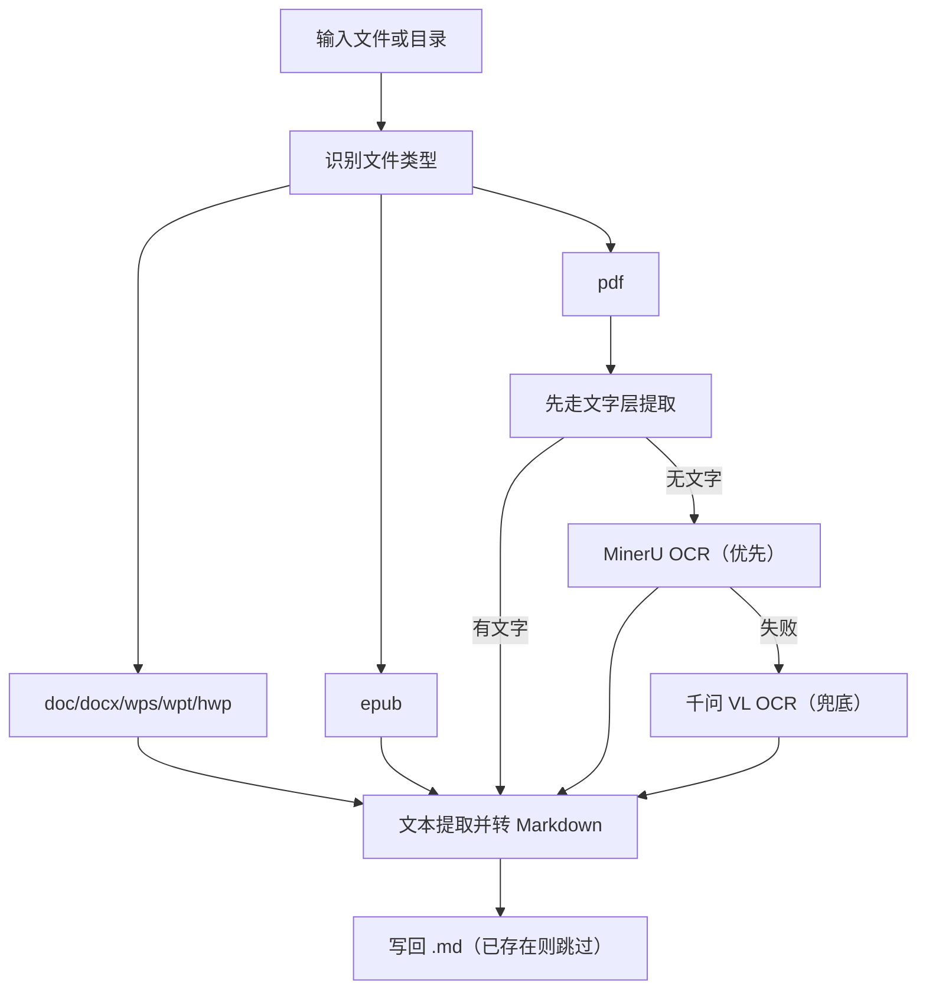

# 文档一键转MD

[](https://www.python.org/)
[](#)
[](#支持格式)
[](#使用方式)

> 项目代号：`convert_mixed_to_md`
>
> 对外名称：**文档一键转MD**

批量把 `.doc`、`.docx`、`.epub`、`.pdf`、`.wps`、`.wpt`、`.hwp` 和常见图片转成 Markdown，默认自动跳过已转换文件，适合持续整理资料库。

> **必看：扫描版 PDF 优先使用 MinerU，失败后可用千问 VL 兜底**
>
> - 普通 PDF（有文字层）通常不需要 token。  
> - 扫描版 / 纯图片 PDF 会先尝试 MinerU；如果 MinerU 不可用或失败，会继续尝试千问 VL。  
> - 千问 VL 需要 `DASHSCOPE_API_KEY`，可通过环境变量或 `~/cc/config/ocr.yaml` 配置。

## 快速开始

1. 安装 Python 3.9+。  
2. 安装系统命令：`pandoc` + `pdftotext`。  
3. 直接运行一键脚本。

| 场景 | 启动方式 |
|---|---|
| macOS | 双击 `run.command` 或拖文件/目录到 `run.command` |
| Windows | 双击 `run_windows.bat` 或拖文件/目录到 `run_windows.bat` |

运行前可先做环境体检：

```bash
python3 convert_mixed_to_md.py --check
```

你也可以用短名入口：

- `mix2md.command`（macOS）
- `mix2md.bat`（Windows）
- `mix2md.py`（命令行）

## 工作流


```mermaid
flowchart TD
    A["输入文件或目录"] --> B["识别文件类型"]
    B --> C["doc/docx/wps/wpt/hwp"]
    B --> D["pdf"]
    B --> E["epub"]
    C --> F["文本提取并转 Markdown"]
    E --> F
    D --> G["先走文字层提取"]
    G -->|有文字| F
    G -->|无文字| H["MinerU OCR（优先）"]
    H -->|失败| J["千问 VL OCR（兜底）"]
    H --> F
    J --> F
    F --> I["写回 .md（已存在则跳过）"]
```

## Pipeline 架构（已重构）

当前实现采用 Pipeline 模式，主入口只做参数解析与调度：

- `convert_mixed_to_md.py`
  - 负责 CLI 参数与 pipeline 顺序调用
- `mix2md_pipeline/steps/discover.py`
  - 输入发现（文件扫描、输出目录基线）
- `mix2md_pipeline/steps/preflight.py`
  - 依赖与环境提示
- `mix2md_pipeline/steps/convert.py`
  - 核心逐文件转换（成功/跳过/失败）
- `mix2md_pipeline/steps/report.py`
  - 结果汇总与退出码
- `legacy_engine.py`
  - 保留原成熟转换能力（格式解析、OCR、清洗逻辑）

这样做的好处是：流程层与能力层解耦，后续加新步骤（比如质量检查、重试策略）会更稳定。

## 支持格式

| 格式 | 处理方式 | 备注 |
|---|---|---|
| `.doc` | 旧版解析 + 兜底提取 | 建议尽量转 `.docx` 更稳 |
| `.docx` | `pandoc` | 稳定 |
| `.epub` | `pandoc` | 可能生成 `_assets` 资源目录 |
| `.pdf` | 文字层提取 + OCR 兜底 | 扫描版建议配置 `MINERU_TOKEN` |
| `.jpg/.jpeg/.png/.webp/.bmp/.gif/.tif/.tiff` | 千问 VL OCR | 需要 `DASHSCOPE_API_KEY` |
| `.wps/.wpt` | 旧版文档解析 | 成功率受原始文件影响 |
| `.hwp` | `hwp5txt`（自动安装 `pyhwp`） | 首次可能稍慢 |

## 安装

### 1. Python

需要 Python 3.9+。

### 2. 系统命令

macOS:

```bash
brew install pandoc poppler
```

Windows（任选一种）:

PowerShell + winget:

```powershell
winget install --id JohnMacFarlane.Pandoc -e
winget install --id oschwartz10612.Poppler -e
```

Chocolatey:

```powershell
choco install pandoc poppler -y
```

安装后请确认：

- `pandoc`
- `pdftotext`

说明：`pandoc` 和 `pdftotext` 是第三方工具官方命令名，不能改名。  
我们已在项目内提供了可自定义短名入口 `mix2md`（见上）。

### 3. Python 依赖（自动）

脚本首次运行会自动创建本地 `.venv` 并安装 `requirements.txt`。  
通常不需要手动 `pip install`。

说明：`requests` 仅在 MinerU OCR 路径下需要；`anthropic` 仅在千问 VL 兜底或图片 OCR 路径下需要，普通文本层转换可不依赖它。

## 使用方式

### 一键方式（推荐）

- macOS：`run.command`
- Windows：`run_windows.bat`

说明：启动脚本会先提示是否输入 `MINERU_TOKEN`（可回车跳过），方便你先配置扫描版 PDF 的优先 OCR。

Windows 版支持：

- 双击运行
- 拖拽文件/目录
- 连续输入多路径
- 粘贴多路径（如 `"C:\a.docx" "D:\b.pdf"` 或 `C:\a.docxC:\b.pdf`）

### 命令行方式

macOS / Linux:

```bash
python3 mix2md.py '/path/to/folder'
python3 convert_mixed_to_md.py '/path/to/folder'
python3 convert_mixed_to_md.py '/path/to/file.epub'
python3 convert_mixed_to_md.py '/path/to/folder' -o '/path/to/output'
python3 convert_mixed_to_md.py '/path/to/file.pdf' --polish auto
python3 convert_mixed_to_md.py '/path/to/book.epub' --polish book --report
```

Windows:

```powershell
python .\mix2md.py "C:\path\to\folder"
python .\convert_mixed_to_md.py "C:\path\to\folder"
python .\convert_mixed_to_md.py "C:\path\to\file.epub"
python .\convert_mixed_to_md.py "C:\path\to\folder" -o "C:\path\to\output"
python .\convert_mixed_to_md.py "C:\path\to\file.pdf" --polish auto
```

## 转换后整理与质量审核

默认只做格式转换，不改变原有使用习惯。需要整理和质检时，可显式开启：

```bash
python3 convert_mixed_to_md.py '/path/to/file.pdf' --polish auto
```

可选模式：

| 模式 | 作用 |
|---|---|
| `none` | 默认关闭 |
| `auto` | 自动判断法律文本、书籍或普通文档 |
| `legal` | 整理法律法规结构：名称、编、章、节、条 |
| `judgment` | 整理法院判决/裁定、仲裁裁决等裁判裁决文书 |
| `notice` | 整理查封、冻结、评估报告、协助执行等通知类文书 |
| `book` | 整理书籍结构：书名、目录、前言、章节 |
| `generic` | 只做基础空白清理 |

启用 `--polish` 后会生成 `<文件名>+审核报告.md`。报告会记录实际模式、是否改动、保真检查结果和处理统计。

保真检查会忽略 Markdown 标题符号与空白差异，比对正文字符流；如果发现非空白字符变化，脚本不会覆盖最终 Markdown，并会保留中间文件用于排查。

如需保留过程产物：

```bash
python3 convert_mixed_to_md.py '/path/to/file.pdf' --polish auto --artifact-level standard
```

`--report` 可以单独使用，只生成审核报告，不整理正文。

## 扫描版 PDF 与 OCR 优先级

扫描版 PDF 的优先级是：

```text
PDF 文字层提取 -> MinerU OCR -> 千问 VL OCR
```

配置 `MINERU_TOKEN` 后，扫描版 PDF 会优先走 MinerU OCR。

macOS / Linux:

```bash
export MINERU_TOKEN='your_token'
python3 convert_mixed_to_md.py '/path/to/folder'
```

Windows PowerShell:

```powershell
$env:MINERU_TOKEN='your_token'
python .\convert_mixed_to_md.py "C:\path\to\folder"
```

Windows CMD:

```bat
set MINERU_TOKEN=your_token
python .\convert_mixed_to_md.py "C:\path\to\folder"
```

如果 MinerU 失败，脚本会继续尝试千问 VL。千问 VL 配置支持两种方式：

```bash
export DASHSCOPE_API_KEY='your_key'
export DASHSCOPE_BASE_URL='https://dashscope.aliyuncs.com/apps/anthropic'
export QWEN_OCR_MODEL='qwen-vl-plus'
```

或者使用本机配置文件：

```text
~/cc/config/ocr.yaml
```

脚本会读取其中 `engines.qwen` 下的 `api_key`、`base_url`、`model`、`rpm_limit` 和 `cost_per_image`。

## 常见问题

**Q1: 为什么有些 PDF 转换失败？**  
大概率是扫描版且未配置 `MINERU_TOKEN` / `DASHSCOPE_API_KEY`，或 OCR 服务暂时不可用。

**Q2: 为什么 Windows 下旧 `.doc/.wps/.wpt` 成功率不稳定？**  
这类旧格式本身结构复杂，建议优先转 `.docx` 后再转 Markdown。

**Q3: 为什么有的文件被 `[SKIP]`？**  
同名 `.md` 已存在，脚本默认跳过以避免重复覆盖。
